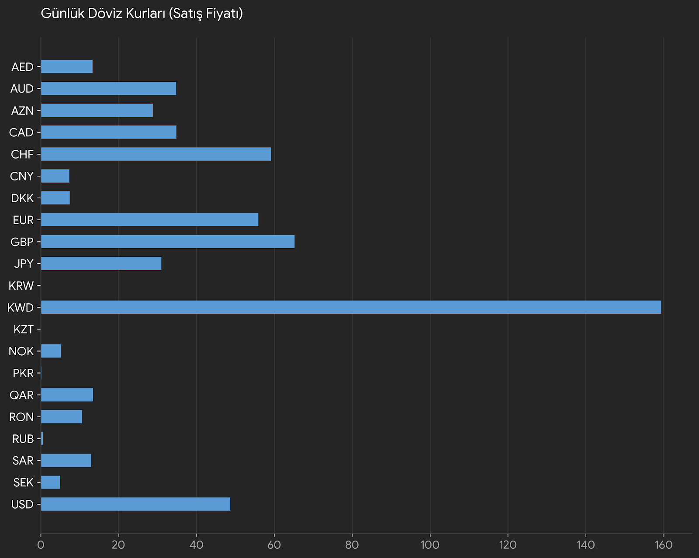

# 💱 TCMB Exchange Rates ETL Pipeline (Python ➔ SQL ➔ Power BI)

An end-to-end Automated ETL (Extract, Transform, Load) Pipeline project that extracts daily currency exchange rates from the Central Bank of the Republic of Turkey (TCMB), loads the data into a relational database, and visualizes it through an interactive business intelligence dashboard.

## 🏗️ Architecture & Technologies

- **Extract (Python):** Uses `requests` and `BeautifulSoup` to scrape and fetch live XML data from the TCMB API. Data manipulation is handled via `pandas`.
- **Load (SQL Server):** Uses `pyodbc` to establish a secure connection (Trusted_Connection) and loads the cleaned DataFrame into Microsoft SQL Server (T-SQL) for robust data storage.
- **Visualize (Power BI):** Connects directly to the SQL Server database to generate dynamic, DAX-driven charts highlighting buying and selling rates of global currencies.

## 📊 Dashboard Preview

*(The chart below displays the final selling prices of global currencies extracted directly from the database.)*

## ⚙️ How It Works

1. **`DovizKuruApi.py`** is executed.
2. The script parses the XML response from the Central Bank.
3. A structured Pandas DataFrame is generated containing `Kur_Kodu`, `Birim_Ismi`, `Alis_Fiyati`, and `Satis_Fiyati`.
4. The data is pushed to a local MS SQL Server database.
5. Power BI reads the tables, applies necessary type conversions (Decimal formatting), and reflects the latest financial metrics.

## 🚀 Potential Use Cases
This pipeline serves as a foundation for building automated financial tracking systems, e-commerce currency converters, or real-time competitor price analysis tools.
